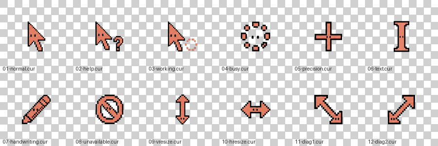

# 🦀 Clawd Cursor

A pixel-art Windows cursor pack starring **Clawd**, a little coral crab. Hand-built, transparent, and ready to install — including a full 12-state scheme plus a bonus "mascot" pointer where Clawd tags along under the arrow.

<p align="center">
  
</p>

<p align="center">
  
</p>

## What's inside

Every cursor is a true `.cur` file with a 32-bit alpha channel and multiple embedded sizes (32 / 48 / 64 / 96 / 128 px) so it stays crisp on high-DPI displays.

| File | Windows role | Hotspot |
|------|--------------|---------|
| `01-normal.cur` | Normal Select | arrow tip |
| `02-help.cur` | Help Select | arrow tip |
| `03-working.cur` | Working in Background | arrow tip |
| `04-busy.cur` | Busy | center |
| `05-precision.cur` | Precision Select | center |
| `06-text.cur` | Text Select | center |
| `07-handwriting.cur` | Handwriting | pen tip |
| `08-unavailable.cur` | Unavailable | center |
| `09-vresize.cur` | Vertical Resize | center |
| `10-hresize.cur` | Horizontal Resize | center |
| `11-diag1.cur` | Diagonal Resize 1 | center |
| `12-diag2.cur` | Diagonal Resize 2 | center |
| `clawd-pointer.cur` | Bonus mascot pointer (arrow + Clawd) | arrow tip |

> Move, Alternate Select, and the link Hand are intentionally left to the system default.

## Install (Windows)

### One-click

1. Download this repo (**Code → Download ZIP**) and unzip it.
2. Open the `cursors/` folder, right-click **`install.inf`** → **Install**
   (on Windows 11 you may need **Show more options** first), and accept the UAC prompt.
   This copies the cursors to `C:\Windows\Cursors\Clawd\` and registers a scheme named **Clawd**.
3. If the pointer doesn't change immediately, log out and back in, or run in **Win+R**:
   ```
   RUNDLL32.EXE USER32.DLL,UpdatePerUserSystemParameters ,1 ,True
   ```

### Manual / per-cursor

Settings → search **"Change mouse cursor"** → **Pointers** tab → pick a state (e.g. *Normal Select*) → **Browse** → choose the matching `.cur`. Click **Save As…** to keep it as a reusable scheme.

To use the **mascot pointer**, set *Normal Select* to `clawd-pointer.cur`.

### Uninstall

Pointers tab → switch the scheme back to **Windows Default** → Apply. To fully remove: delete `C:\Windows\Cursors\Clawd\` and the `Clawd` entry under `HKCU\Control Panel\Cursors\Schemes`.

## macOS

macOS has no built-in cursor-replacement UI. Use a tool like [Mousecape](https://github.com/alexzielenski/Mousecape) and import the PNGs/cursors manually.

## License

Released under the [MIT License](LICENSE). Clawd and the artwork are free to use, remix, and share.
